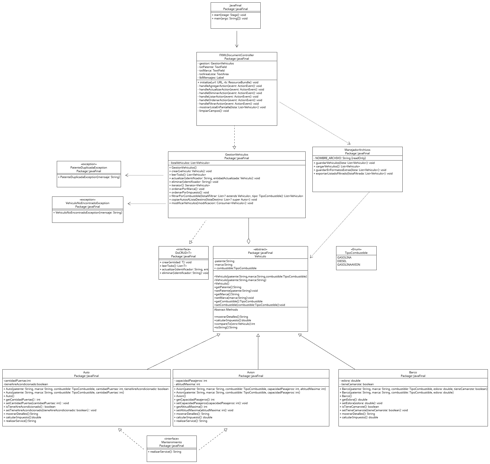

# CRUD - Gestión de Vehículos UTN 

---

##  Sobre mí

Mi nombre es Belkis Guanipa, soy estudiante de la Tecnicatura Universitaria en Programación y esta aplicación corresponde al examen final para Programación II con el lenguaje Java.

---

##  Resumen del Proyecto
Esta aplicación es un sistema integral desarrollado en java junto a **JavaFX** que permite gestionar entidades polimórficas (Autos, Barcos y Aviones) bajo el paradigma de la Programación Orientada a Objetos (POO), siguiendo una estructura de jerarquía de clases base y derivadas.
El sistema implementa una arquitectura estructurada en tres capas principales: una interfaz gráfica interactiva (**JavaFX**), una clase de gestión lógica y un manejador de persistencia de archivos.

### Características Técnicas Implementadas:
**CRUD Completo:** Operaciones de creación, lectura, actualización y eliminación de registros administrados mediante una lista genérica que implementa una interfaz genérica.
* **Estructuras Avanzadas y Genéricos:** Uso de un `Iterator` personalizado para recorrer las colecciones, ordenamiento natural mediante `Comparable` y criterios múltiples con `Comparator` por medio de expresiones Lambda.
* **Uso Eficiente de Wildcards:** Implementación de límites superiores (`? extends Vehiculo`) para operaciones de filtrado dinámico y límites inferiores (`? super Auto`) para la manipulación segura de colecciones en memoria.
* **Interfaces Funcionales:** Modificaciones masivas en lote aplicadas sobre la lista mediante expresiones Lambda basadas en la interfaz funcional `Consumer<Vehiculo>`.
* **Persistencia Multiformato:** Automatización de guardado y lectura de datos nativos mediante serialización, persistencia secundaria en archivos estructurados **CSV** y **JSON**, y exportación de reportes legibles por humanos en formato `.txt`.
* **Manejo de Excepciones Propias:** Control robusto del flujo del programa mediante dos excepciones personalizadas de negocio (`PatenteDuplicadaException` y `VehiculoNoEncontradoException`).

---

##  Demostración de la Interfaz Gráfica (JavaFX)

A continuación se detalla visualmente cómo se utiliza la aplicación y el comportamiento dinámico de sus componentes:

### 1. Pantalla Principal y Carga de Datos
El usuario puede ingresar datos de forma libre, mediante el menú desplegable (`ComboBox`), se define la identidad de la clase hija de manera explícita sin necesidad de forzar o "hardcodear" cadenas de texto en las marcas, distribuyendo el flujo polimórfico correctamente.

### 2. Filtrado Dinámico y Persistencia
Al seleccionar un tipo de vehículo y presionar "Filtrar", la vista se limpia mostrando exclusivamente las coincidencias asociadas al combustible del tipo seleccionado, generando en simultáneo el archivo físico de reportes.

---

## Diagrama de Clases UML

El diseño de la aplicación respeta estrictamente las relaciones de herencia de la clase abstracta base hacia las clases hijas, la implementación de interfaces genéricas para el CRUD y las asociaciones con el controlador visual.

---

## Persistencia y Reportes del Sistema

En el repositorio se incluyen ejemplos prácticos del mecanismo de persistencia y generación de reportes implementado en la aplicación:

| Archivo | Descripción |
|----------|------------|
| `vehiculos.txt` | Archivo utilizado para la persistencia local en formato plano (CSV) con delimitadores, permitiendo la lectura y escritura estructurada de los datos del sistema.. |
| `vehiculos.json` | Representación estructurada de los vehículos almacenados, exportada en formato JSON para facilitar la interoperabilidad de los datos. |
| `reporte_filtrado.txt` | Reporte generado automáticamente a partir de los filtros aplicados por el usuario, organizado con un encabezado descriptivo y formato legible. |
| `vehiculos.dat`| Archivo de persistencia binaria nativa, generado mediante el proceso de serialización de objetos para recuperar de forma exacta el estado de las entidades en la memoria RAM.|
