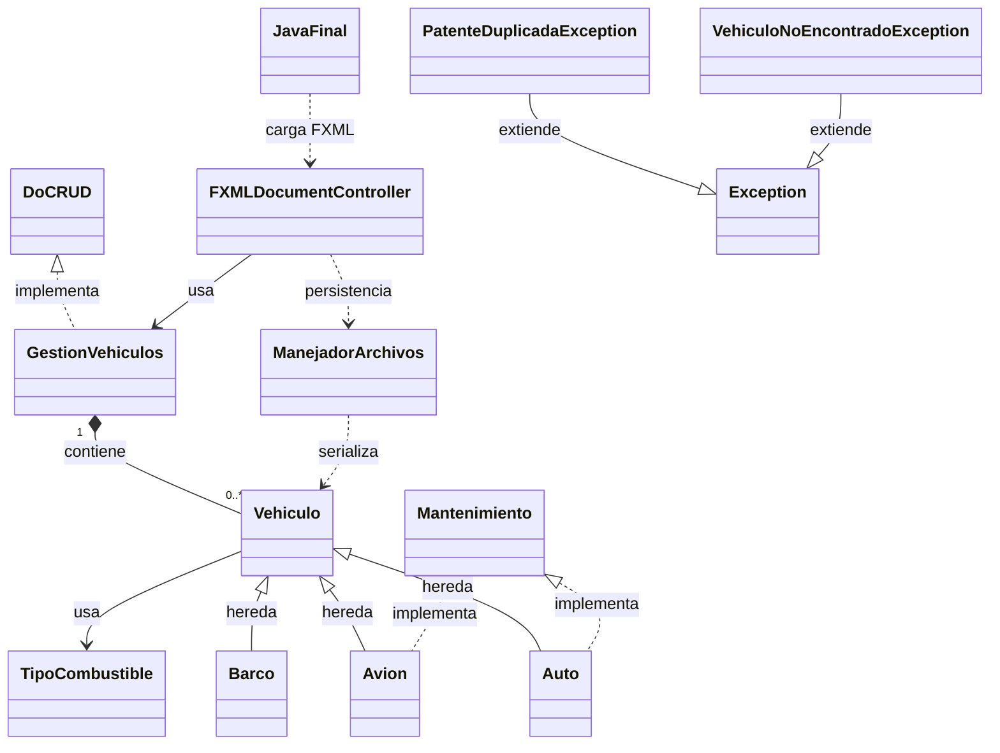

# Diagrama de clases (Mermaid)

Abrir este archivo en vista previa de Markdown para ver el diagrama renderizado.

Si no ves las flechas en el diagrama completo, usa el diagrama simplificado de asociaciones al final.

```mermaid
classDiagram

class TipoCombustible {
  <<enumeration>>
  GASOLINA
  DIESEL
  ELECTRICO
}

class Mantenimiento {
  <<interface>>
  +realizarService() String
}

class "DoCRUD~T~" as DoCRUD {
  <<interface>>
  +crear(entidad: T) void
  +leerTodo() List
  +actualizar(identificador: String, entidadActualizada: T) void
  +eliminar(identificador: String) void
}

class Vehiculo {
  <<abstract>>
  -patente: String
  -marca: String
  +combustible: TipoCombustible
  +Vehiculo(patente: String, marca: String, combustible: TipoCombustible)
  +Vehiculo(patente: String, marca: String)
  +Vehiculo()
  +getPatente() String
  +setPatente(patente: String) void
  +getMarca() String
  +setMarca(marca: String) void
  +getCombustible() TipoCombustible
  +setCombustible(combustible: TipoCombustible) void
  +mostrarDetalles() String
  +calcularImpuesto() double
  +compareTo(otro: Vehiculo) int
  +toString() String
}

class Auto {
  -cantidadPuertas: int
  -tieneAireAcondicionado: boolean
  +calcularImpuesto() double
  +mostrarDetalles() String
  +realizarService() String
}

class Avion {
  -capacidadPasajeros: int
  -altitudMaxima: int
  +calcularImpuesto() double
  +mostrarDetalles() String
  +realizarService() String
}

class Barco {
  -eslora: double
  -tieneCamarote: boolean
  +calcularImpuesto() double
  +mostrarDetalles() String
}

class GestionVehiculos {
  -listaVehiculos: List
  +crear(vehiculo: Vehiculo) void
  +leerTodo() List
  +actualizar(identificador: String, entidadActualizada: Vehiculo) void
  +eliminar(identificador: String) void
  +ordenarPorMarca() void
  +ordenarPorImpuesto() void
  +filtrarPorCombustible(listaAFiltrar: List, tipo: TipoCombustible) List
}

class ManejadorArchivos {
  +guardarVehiculos(lista: List) void
  +cargarVehiculos() List
  +guardarEnFormatosExtras(lista: List) void
  +exportarListadoFiltrado(listaFiltrada: List) void
}

class FXMLDocumentController {
  -gestion: GestionVehiculos
  +initialize(url, rb) void
  +handleAgregarAction(event) void
  +handleActualizarAction(event) void
  +handleEliminarAction(event) void
  +handleListarAction(event) void
  +handleOrdenarAction(event) void
  +handleFiltrarAction(event) void
}

class JavaFinal {
  +start(stage) void
  +main(args) void
}

class PatenteDuplicadaException
class VehiculoNoEncontradoException
class Exception

Vehiculo <|-- Auto
Vehiculo <|-- Avion
Vehiculo <|-- Barco
Mantenimiento <|.. Auto
Mantenimiento <|.. Avion
DoCRUD <|.. GestionVehiculos
GestionVehiculos "1" *-- "0..*" Vehiculo : contiene
Vehiculo --> TipoCombustible
FXMLDocumentController --> GestionVehiculos : usa
FXMLDocumentController ..> ManejadorArchivos : persistencia
ManejadorArchivos ..> Vehiculo : serializa
PatenteDuplicadaException --|> Exception
VehiculoNoEncontradoException --|> Exception
JavaFinal ..> FXMLDocumentController : carga FXML
```

## Asociaciones (vista simplificada)


